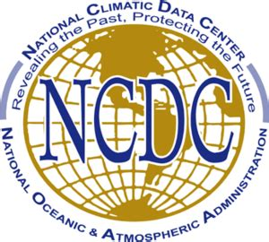

{alt="" style="width: 25%; display: inline-block;"}
{alt="" style="width: 25%; display: inline-block;"}
{alt="" style="width: 25%; display: inline-block;"}
{alt="" style="width: 25%; display: inline-block;"}

This lesson aims to teach researchers basic concepts, skills,
and tools for working with data so that they can get more done in less
time, and with less pain. The lessons below were designed for those interested
in working with ecology data in R.

This is an introduction to R designed for participants with no programming
experience. They start with some basic information about R syntax, the RStudio 
interface, and move through how to import CSV files, the structure of data frames, 
how to deal with factors, how to add/remove rows and columns, how to calculate 
summary statistics from a data frame, and a brief introduction to plotting. 

This lesson assumes no prior knowledge of R or RStudio and no programming
experience.

## Contributors

This lesson was inspired by Software and Data Carpentry Workshops.
